# 🏋️‍♂️ Fitness App - Tu Entrenador Personal Inteligente

[](https://reactjs.org/)
[](https://expo.dev/)
[](https://nodejs.org/)
[](https://www.mongodb.com/)
[](LICENSE.txt)

Una aplicación completa de fitness que incluye una interfaz web (React), una aplicación móvil (React Native con Expo) y un servidor backend (Node.js con Express y MongoDB). Permite a los usuarios registrarse, iniciar sesión, obtener dietas y rutinas personalizadas mediante un chatbot interactivo que utiliza algoritmos inteligentes para generar planes adaptados a cada usuario.

---

## ✨ Características

### 🔐 Registro y Autenticación
- Sistema completo de registro con validación de datos
- Inicio de sesión seguro con JWT
- Recuperación de contraseña vía email
- Protección de rutas y datos personales

### 👤 Perfiles Personalizados
- Edición completa de perfil de usuario
- Datos físicos: altura, peso, edad, género
- Objetivos de fitness: ganar masa muscular, perder grasa, mantener
- Nivel de experiencia: principiante, intermedio, avanzado
- Preferencias alimentarias y restricciones
- Gestión de alergias e intolerancias

### 🍎 Dietas Personalizadas
- Generación automática de planes nutricionales
- Basados en objetivos, nivel de actividad y preferencias
- Cálculo de macronutrientes (proteínas, carbohidratos, grasas)
- Menús diarios completos 
- Consideración de alergias y restricciones dietéticas
- Sistema de progresión adaptativo

### 💪 Rutinas de Ejercicio
- Creación de rutinas de entrenamiento personalizadas
- Planes de 4 semanas con progresión automática
- Ejercicios específicos según grupo muscular y nivel
- Detalles de series, repeticiones y descansos
- Sistema de seguimiento semanal
- Regeneración automática al completar ciclos

### 🤖 Chatbot Interactivo
- Conversación natural para recopilar información
- Preguntas personalizadas según el objetivo del usuario
- Navegación intuitiva con opciones predefinidas
- Capacidad de entrada de texto libre cuando es requerido
- Generación de planes basados en las respuestas

### 📱 Aplicación Móvil
- Versión completa para iOS y Android con Expo
- Funcionalidades similares a la versión web
- Interfaz optimizada para dispositivos móviles
- Sincronización con el backend

### 🔒 Seguridad
- Hash de contraseñas con bcrypt
- Autenticación basada en JWT
- Rate limiting para prevenir ataques
- CORS configurado
- Helmet para headers de seguridad
- Validación de datos en frontend y backend

---

## 🚀 Tecnologías Utilizadas

### Frontend Web
- **React 19** - Librería de interfaz de usuario
- **React Router DOM** - Navegación SPA
- **Testing Library** - Testing de componentes
- **React Scripts** - Configuración de desarrollo
- **Web Vitals** - Métricas de rendimiento

### Aplicación Móvil
- **React Native** - Framework multiplataforma
- **Expo** - Plataforma de desarrollo
- **React Navigation** - Sistema de navegación
- **AsyncStorage** - Almacenamiento local
- **React Native Gesture Handler** - Manejo de gestos
- **React Native Safe Area Context** - Áreas seguras
- **React Native Screens** - Optimización de pantallas

### Backend
- **Node.js** - Entorno de ejecución
- **Express.js** - Framework web
- **MongoDB** - Base de datos NoSQL
- **Mongoose** - ODM para MongoDB
- **bcryptjs** - Hash de contraseñas
- **Nodemailer** - Envío de correos electrónicos
- **Express Validator** - Validación de datos
- **Helmet** - Seguridad de headers HTTP
- **Express Rate Limit** - Limitación de peticiones
- **CORS** - Manejo de solicitudes cruzadas
- **Dotenv** - Variables de entorno
- **JWT** - Tokens de autenticación

### Algoritmos y Lógica
- **Sistema de Matching** - Selección inteligente de ejercicios y alimentos
- **Generador de Rutinas** - Algoritmo de progresión adaptativa
- **Generador de Dietas** - Cálculo de requerimientos nutricionales
- **Base de Datos Estructurada** - Ejercicios y alimentos categorizados

---

## 📦 Instalación y Configuración

### Prerrequisitos
- **Node.js** (versión 14 o superior)
- **MongoDB** (local o en la nube, e.g., MongoDB Atlas)
- **Expo CLI** (para la app móvil)
- **npm** o **yarn**

### 1️⃣ Configuración del Servidor

1. Navega al directorio `server`:
   ```bash
   cd server
   ```

2. Instala las dependencias:
   ```bash
   npm install
   ```

3. Crea un archivo `.env` en el directorio `server` con las siguientes variables:
   ```env
   MONGODB_URI=mongodb://localhost:27017/fitnessapp
   FRONTEND_URL=http://localhost:3000
   EMAIL_USER=tu_email@gmail.com
   EMAIL_PASS=tu_contraseña_de_aplicación
   JWT_SECRET=tu_secreto_jwt_super_seguro (Para los correos de recuperación de contraseña)
   PORT=4000
   ```

4. Inicia el servidor:
   ```bash
   npm run dev
   ```

El servidor estará disponible en `http://localhost:4000`

### 2️⃣ Configuración del Frontend Web

1. Navega al directorio `frontend`:
   ```bash
   cd frontend
   ```

2. Instala las dependencias:
   ```bash
   npm install
   ```

3. (Opcional) Crea un archivo `.env` si necesitas configurar la URL del API:
   ```env
   REACT_APP_API_URL=http://localhost:4000
   ```

4. Inicia la aplicación:
   ```bash
   npm start
   ```

La aplicación web estará disponible en `http://localhost:3000`

### 3️⃣ Configuración de la App Móvil

1. Navega al directorio `mobile`:
   ```bash
   cd mobile
   ```

2. Instala las dependencias:
   ```bash
   npm install
   ```

3. Instala Expo CLI globalmente si no lo tienes:
   ```bash
   npm install -g @expo/cli
   ```

4. Actualiza la URL del API en la configuración de la app móvil

5. Inicia la aplicación:
   ```bash
   npm start
   ```

Escanea el código QR con la app de **Expo Go** en tu dispositivo móvil.

---

## 📖 Uso

### Primeros Pasos

1. **Regístrate** en la aplicación proporcionando:
   - Email y contraseña
   - Datos personales (nombre, edad, género)
   - Información física (altura, peso)
   - Objetivos de fitness
   - Preferencias y restricciones alimentarias

2. **Inicia sesión** con tu email y contraseña

3. **Usa el chatbot** para generar tu rutina y dieta:
   - Responde las preguntas sobre tus objetivos
   - Proporciona información sobre tu nivel de experiencia
   - Especifica tus preferencias de entrenamiento

4. **Accede al menú principal** para:
   - Ver tu dieta personalizada
   - Consultar tu rutina de ejercicios
   - Marcar semanas completadas y avanzar en la rutina
   - Generar nuevos planes

5. **Edita tu perfil** según evolucionen tus necesidades

---

## 🏗️ Estructura del Proyecto

```
fitnessapp/
├── frontend/                 # Aplicación web React
│   ├── public/
│   ├── src/
│   │   ├── components/      # Componentes React
│   │   │   ├── Login.jsx
│   │   │   ├── Register.jsx
│   │   │   ├── MainMenu.jsx
│   │   │   ├── ForgotPassword.jsx
│   │   │   ├── ResetPassword.jsx
│   │   │   ├── PrivacyPolicy.jsx
│   │   │   ├── TermsAndConditions.jsx
│   │   │   ├── ProtectedRoute.jsx
│   │   │   ├── Chatbot.jsx
│   │   │   ├── RutinaViewer.jsx
│   │   │   ├── DietaViewer.jsx
│   │   │   ├── Profile.jsx
│   │   │   └── CustomAlert.jsx
│   │   ├── hooks/           # Custom hooks
│   │   │   └── useAlert.js
│   │   ├── styles/          # Estilos CSS
│   │   │   ├── Register.css
│   │   │   ├── CustomAlert.css
│   │   │   ├── ProfileEdit.css
│   │   │   ├── MainMenu.css
│   │   │   └── Chatbot.css
│   │   ├── config.js        # Configuración
│   │   └── App.js           # Componente principal
│   └── package.json
│
├── mobile/                   # Aplicación móvil React Native
│   ├── src/
│   │   ├── components/      # Componentes React Native
│   │   │   ├── screens/     # Pantallas
│   │   │   └── navigation/  # Navegación
│   │   ├── services/        # Servicios API
│   │   └── utils/           # Utilidades
│   ├── app.json
│   └── package.json
│
├── server/                   # Servidor backend Node.js
│   ├── routes/              # Rutas de la API
│   │   ├── auth.js          # Manejo de credenciales
│   │   ├── rutinaUtils.js   # Generador de rutinas
│   │   └── dietaUtils.js    # Generador de dietas
│   ├── models/              # Modelos de MongoDB
│   │   └── User.js
│   ├── config/              # Configuraciones
│   │   └── email.js         # Configuración email
│   ├── .env                 # Variables de entorno
│   ├── index.js            # Punto de entrada
│   └── package.json
│
├── LICENSE.txt              # Licencia ISC
└── README.md                # Este archivo
```

---

## 🔑 Características Técnicas Destacadas

### Sistema de Generación de Rutinas
- **Algoritmo de Progresión**: Las rutinas evolucionan semana a semana
- **Selección Inteligente**: Ejercicios según grupo muscular, nivel y objetivo
- **Distribución Óptima**: Volumen de entrenamiento balanceado
- **Variedad**: Rotación de ejercicios para evitar estancamiento
- **Ciclos de 4 Semanas**: Reinicio automático con nuevos ejercicios

### Sistema de Generación de Dietas
- **Cálculo de TDEE**: Total Daily Energy Expenditure según datos del usuario
- **Distribución de Macros**: Personalizada según objetivo (bulk, cut, mantain)
- **Selección de Alimentos**: Basada en preferencias y restricciones
- **Balance Nutricional**: Variedad de nutrientes en cada comida
- **Timing de Nutrientes**: Distribución óptima durante el día

### Base de Datos Estructurada
- **Ejercicios**: Categorizados por grupo muscular y dificultad
- **Alimentos**: Con información nutricional completa
- **Sistema de Tags**: Para filtrado y búsqueda avanzada
- **Escalabilidad**: Fácil adición de nuevos datos

### Arquitectura y Seguridad
- **Arquitectura REST**: API bien estructurada
- **Autenticación JWT**: Tokens seguros con expiración
- **Validación en Capas**: Frontend y backend
- **Rate Limiting**: Protección contra ataques de fuerza bruta
- **Sanitización**: Prevención de inyecciones

---

## 🎨 Capturas de Pantalla

### Aplicación Web desde ordenador
<p align="center"> 
    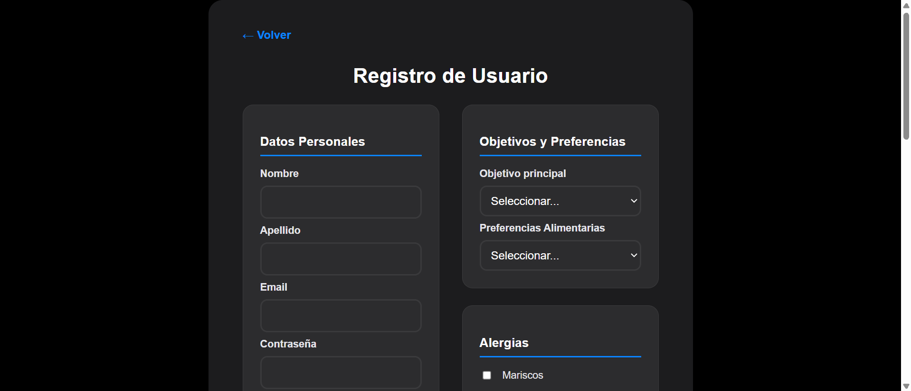 
    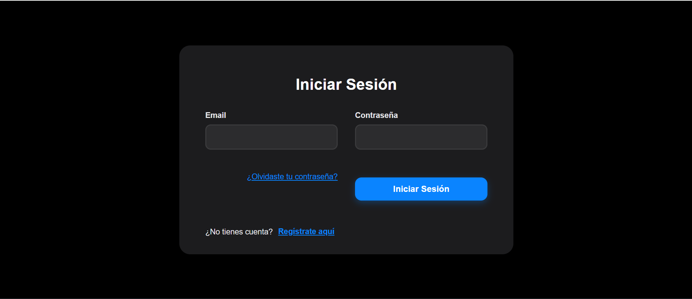 
</p> 
<p align="center"> 
    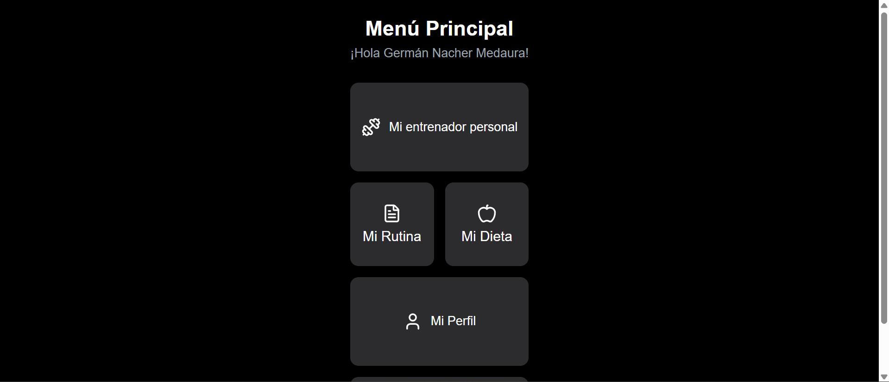
    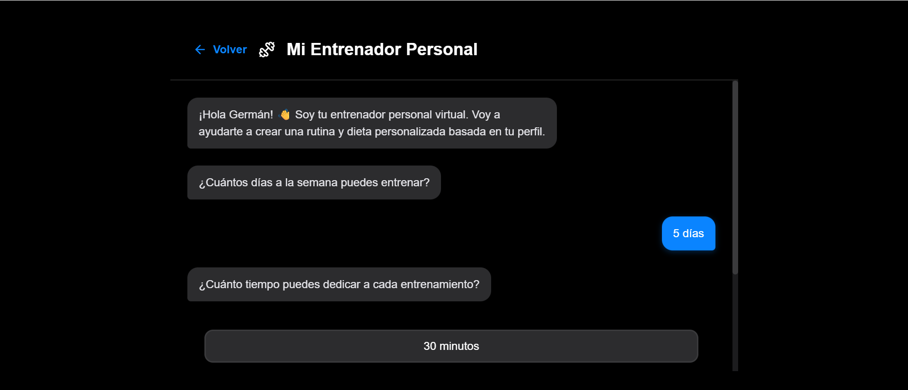 
</p> 
<p align="center"> 
    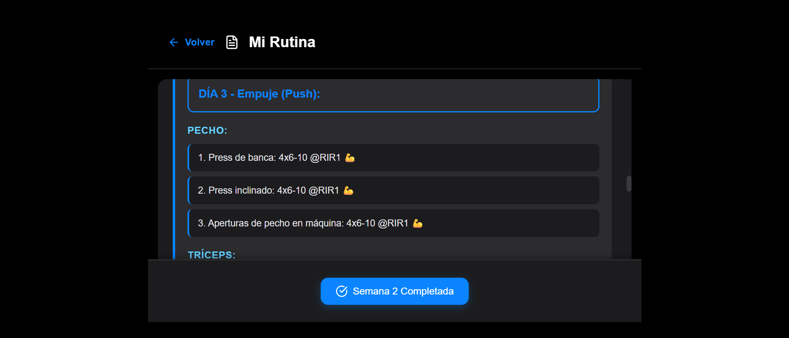 
    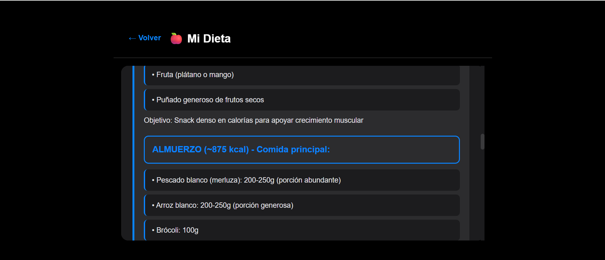 
</p> 
<p align="center"> 
    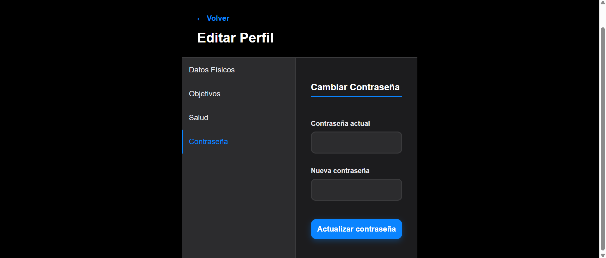 
</p>

### Aplicación Web desde móvil
<p align="center"> 
    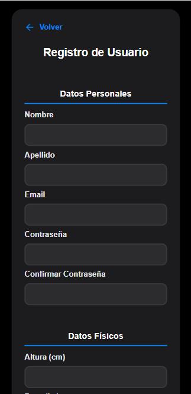 
    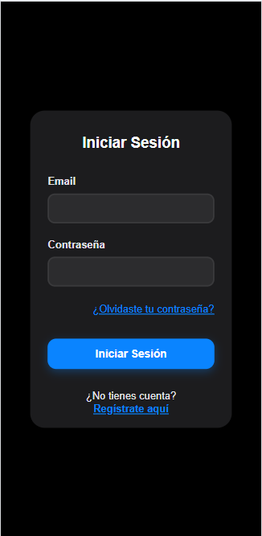 
    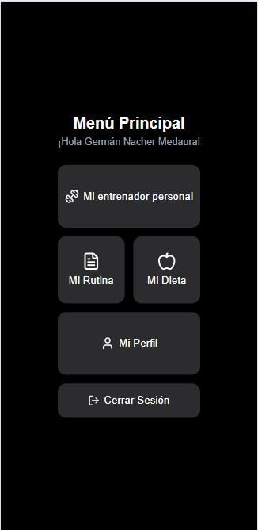 
</p> 
<p align="center"> 
    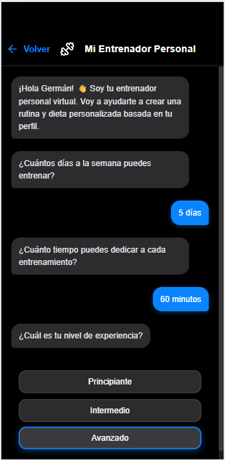 
    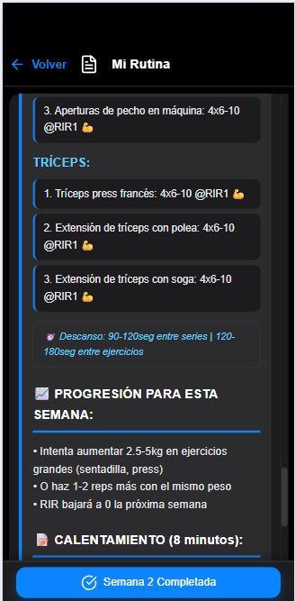 
    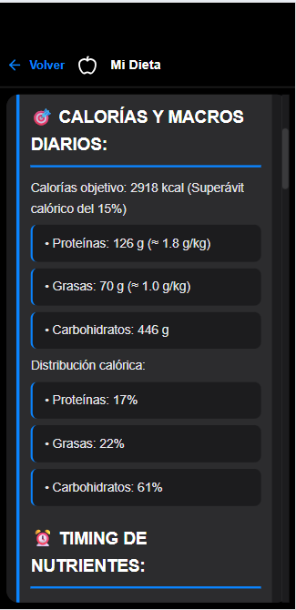 
</p> 
<p align="center"> 
    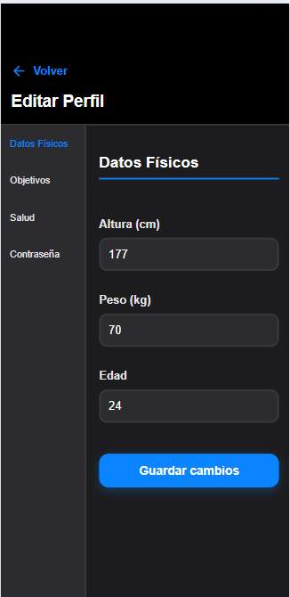 
</p>

### Aplicación Móvil
<p align="center"> 
    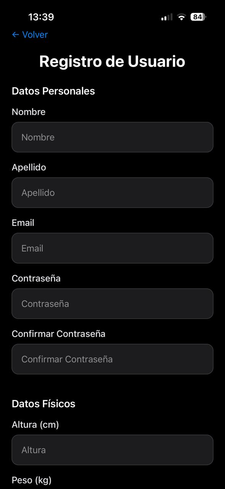 
    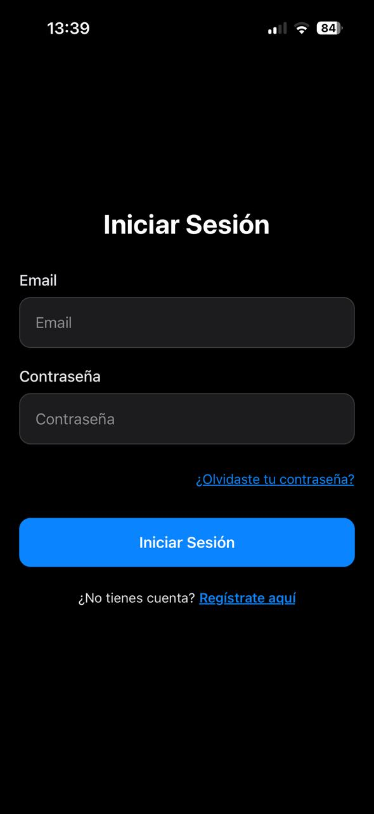 
    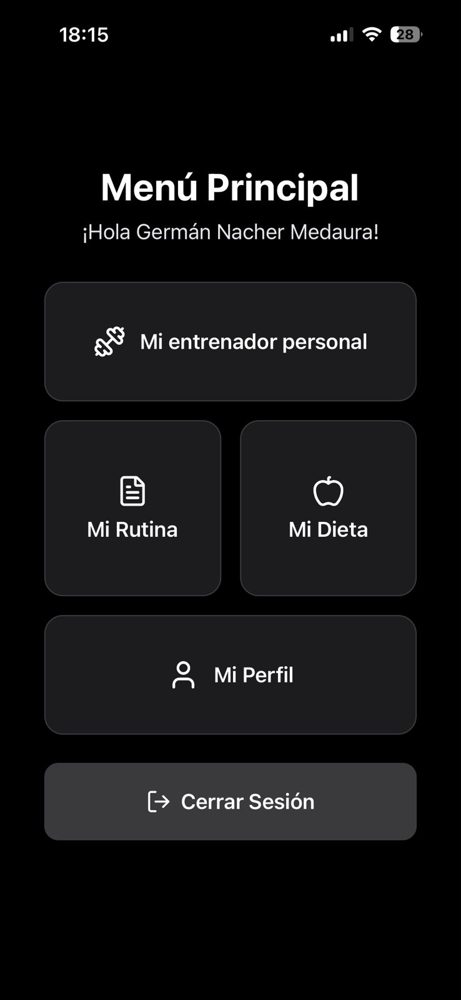 
</p> 
<p align="center"> 
     
    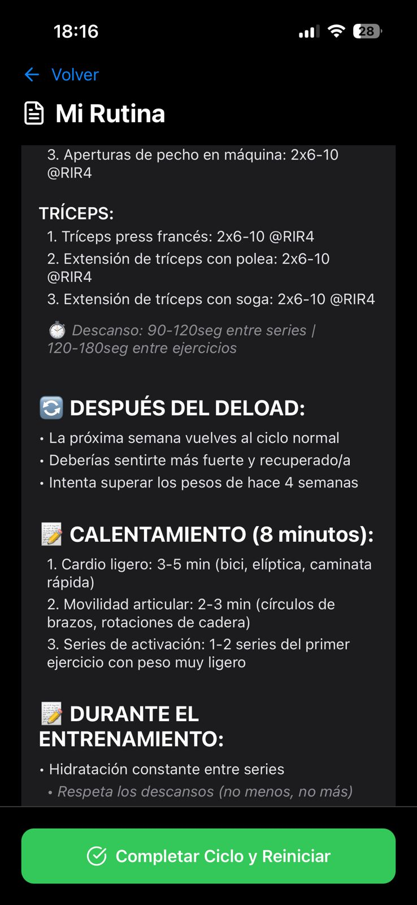 
    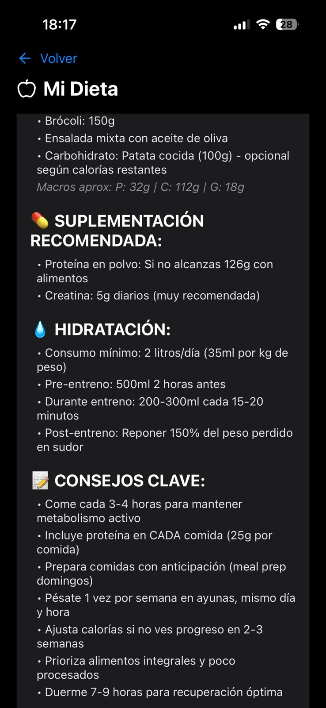 
</p> 
<p align="center"> 
    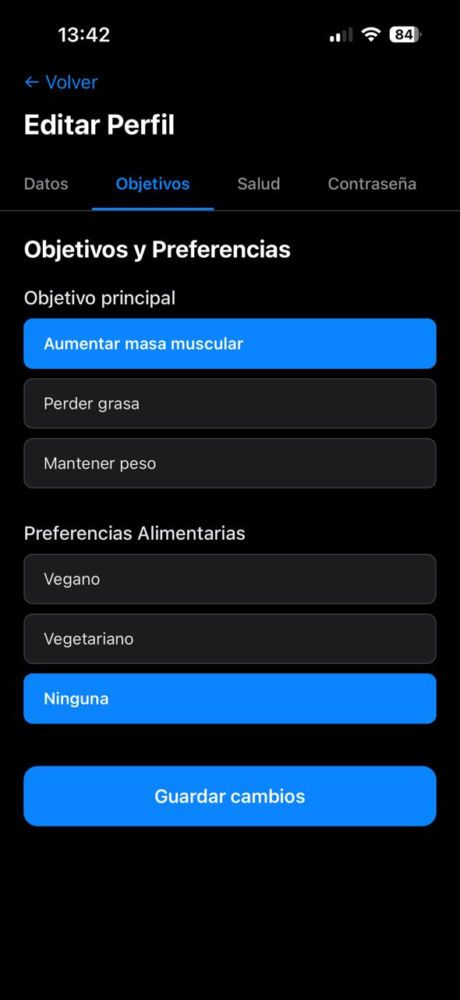 
</p>
---

## 🤝 Contribución

Las contribuciones son bienvenidas y apreciadas. Para contribuir:

1. **Fork** el proyecto
2. Crea una rama para tu feature:
   ```bash
   git checkout -b feature/nueva-funcionalidad
   ```
3. Haz **commit** de tus cambios:
   ```bash
   git commit -am 'Agrega nueva funcionalidad'
   ```
4. Haz **push** a la rama:
   ```bash
   git push origin feature/nueva-funcionalidad
   ```
5. Abre un **Pull Request**

### Guía de Contribución
- Sigue las convenciones de código existentes
- Agrega tests para nuevas funcionalidades
- Actualiza la documentación según sea necesario
- Asegúrate de que todos los tests pasen

---

## 📝 Roadmap

### Próximas Funcionalidades
- [ ] Panel de administración para gestionar ejercicios y alimentos
- [ ] Integración con wearables (Fitbit, Apple Watch, etc.)
- [ ] Videos demostrativos de ejercicios
- [ ] Sistema de logros y gamificación
- [ ] Gráficos de progreso y estadísticas detalladas
- [ ] Modo social: amigos, competencias y rankings
- [ ] Notificaciones push para recordatorios de entrenamiento
- [ ] Modo offline con sincronización automática
- [ ] Lista de compras generada automáticamente
- [ ] Calculadora de 1RM y otras métricas
- [ ] Exportar planes en PDF
- [ ] Integración con MyFitnessPal
- [ ] Versión premium con features avanzadas

---

## 🐛 Problemas Conocidos

Si encuentras algún bug, por favor:
1. Verifica que no esté ya reportado en [Issues](https://github.com/germinacher/fitness-app/issues)
2. Abre un nuevo issue con:
   - Descripción clara del problema
   - Pasos para reproducirlo
   - Comportamiento esperado vs actual
   - Screenshots si es aplicable
   - Información del entorno (OS, navegador, versión)

---

## 📄 Licencia

Este proyecto está bajo la **Licencia MIT**. Ver el archivo [LICENSE.txt](LICENSE.txt) para más detalles.

---

## 👤 Autor

**Tu Nombre**

- GitHub: [@germinacher](https://github.com/germinacher)
- LinkedIn: [Germán Nacher Medaura](https://linkedin.com/in/german-nacher-medaura)
- Email: germinacher@gmail.com


---

## 🙏 Agradecimientos

- **[React Team](https://reactjs.org/)** - Por el increíble framework de UI
- **[MongoDB](https://www.mongodb.com/)** - Por la base de datos flexible
- **[Expo](https://expo.dev/)** - Por facilitar el desarrollo móvil
- **[Express](https://expressjs.com/)** - Por el framework backend minimalista
- **Comunidad Open Source** - Por las librerías y recursos compartidos
- **Beta Testers** - Por el feedback valioso durante el desarrollo

---

## 💬 Contacto y Soporte

¿Tienes preguntas, sugerencias o necesitas ayuda?

- 📧 Email: germinacher@gmail.com
- 💬 Abre un [Issue](https://github.com/germinacher/fitness-app/issues)
- 📱 LinkedIn: [Germán Nacher Medaura](https://linkedin.com/in/german-nacher-medaura)

---

## ⭐ Dale una Estrella

Si este proyecto te fue útil o te gustó, ¡considera darle una estrella en GitHub! Esto ayuda a que más personas lo descubran.

[](https://github.com/germinacher/fitness-app)

---

**Hecho con ❤️ y 💪 para la comunidad fitness**